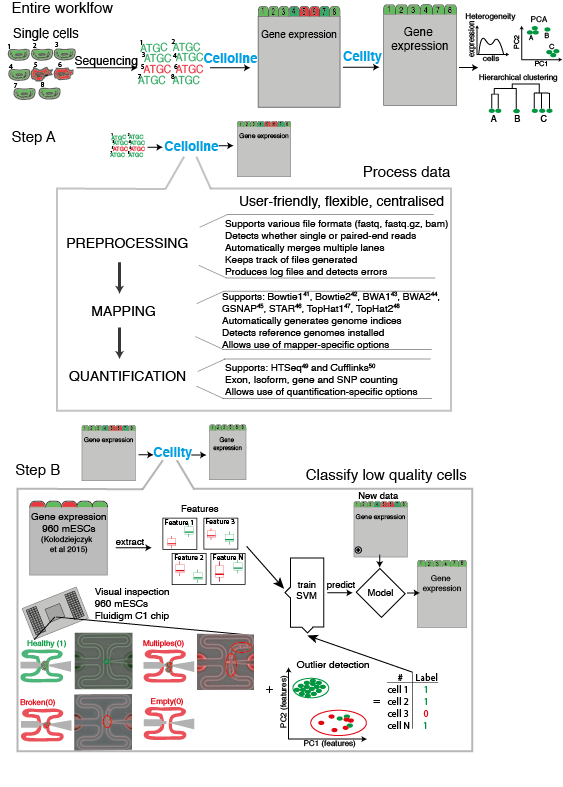

# cellity: Classification of low quality cells in scRNA-seq data using R

The `cellity` package contains functions to help to identify low quality cells in scRNA-seq data. 
It extracts biological and technical features from gene expression data that help to detect low quality cells.

Input Requirements: 
`cellity` requires 1xgene expression matrix (Genes x Cells) and 1x Read statistics matrix (Cells x Metrics) that can be obtained by processing your data first with [`celloline`]. This will map your data and generate a counts-table + statistics about reads. For further details about [`celloline`] please check (https://github.com/ti243/celloline).

The package features:

* ability to extract meaningful biological and technical features from gene expression data
* PCA-based visualisation of low quality cells and illustration of most informative features
* SVM-based classification of low quality cells

Future versions of `cellity` may also incorporate:

* Wider range of biological and technical features that could help to distinguish high from low quality cells
* Alternatives to SVM and PCA for detection and visualisation 
* More organisms and cell types that are supported by default

See below for information about installation, getting started and highlights of the package.

## Installation over Bioconductor
The `cellity` package has been accepted by
[Bioconductor](http://bioconductor.org/). If you have bionconductor installed ('https://www.bioconductor.org/install/'), use the following command below. That will install the appropriate `cellity` version on your installed R version. 

```
## try http:// if https:// URLs are not supported
source("https://bioconductor.org/biocLite.R")
biocLite("cellity")
```
Please bear in mind, that there is no release version of `cellity` yet and you will therefore need to use the R development verison 3.3 ('http://r.research.att.com/mavericks/R-devel/R-devel-mavericks-signed.pkg').  

From the 16th of April `cellity` will be available for both the release and development versions of R. 
As the `cellity` package has recently been submitted to Bioconductor, 
development of the package is proceeding with the development version of R 
(version 3.3). As such, using `cellity` with the current release version of R is
not supported. 

## Installation over Github
**If you are using the development version of R, 3.3:**
Installation is possible directly from Github, but it requires manual installation of all dependepent pacakges.
Similarily, to the bioconductor installation, you need to have the R 3.3 development version installed. 

Once you have installed the R development version, copy and paste following commands to install all required pacakges:

CRAN packages:
```{r}
install.packages(c("devtools", ggplot2", "knitr","testthat","e1071", "graphics", "grDevices", "grid", "mvoutlier", "robustbase", "stats", "utils", "caret", "rmarkdown"))
```

Bioconductor packages:
```{r}
source("https://bioconductor.org/biocLite.R")
biocLite(c("AnnotationDbi", "org.Hs.eg.db", "org.Mm.eg.db", "topGO", "BiocStyle"))
```

Some packages might need other dependencies to be intalled in addition. If this is the case (displayed by an error message within R) use the same command to install the dependent packages.
After successful installation of the packages listed above, we recommend using Hadley Wickham's 
`devtools` package to 
install `cellity` directly from GitHub by executing following command:

```{r}
devtools::install_github("ti243/cellity", build_vignettes = TRUE)
```

## Getting started

<!---
The best place to start is the [vignette](http://htmlpreview.github.io/?http://github.com/davismcc/scater/blob/master/vignettes/vignette.html).
-->

The best place to start is the vignette. From inside an R session, load `cellity`
and then browse the vignettes:

```{r}
library(cellity)
browseVignettes("cellity")
```

There is a detailed HTML document available that introduces the main features
and functionality of `cellity`.

## `cellity` workflow

The diagram below provides an overview of the functionallity of `cellity` and its partner tool `celloline`(https://github.com/ti243/celloline).




## Highlights

The `cellity` package allows you:

1. ability to extract meaningful biological and technical features from gene expression data
2. PCA-based visualisation of low quality cells and illustration of most informative features
3. SVM-based classification of low quality cells

For details of how to use these functions, please consult the **vignette** and **package documentation**.  The plots shown use the example data included with the package and as shown require only one or two lines of code to generate.

### Feature extraction

Use the `extract_features` to extract both, technical and biological features from your data. To use the function you need pre-processed data. You need to provide a matrix containing gene expression levels (Genes x Cells) that either raw reads normalised by total counts or TPM values (e.g. converted from FPKM cufflinks). Also, you will need a matrix with read statistics of your data (Cells x Metrics). 

To get both pieces of data, use `celloline`(https://github.com/ti243/celloline) which is a python package that can pre-process your data and outputs both, a gene expression and read statistics matrix.

### Visualisation of low quality cells `assess_cell_quality_PCA`

The `assess_cell_quality_PCA` function provides the ability to visualise low quality cells by performing a PCA on features. It than uses an outlier detection algorithm to determine what are high and low quality cells. Moreover, it outputs the most informative features that can indicate what is going on in these cells in terms of quality.

### Classification of low quality cells `assess_cell_quality_SVM`

Using `assess_cell_quality_SVM` one predict low quality cells in their data by using either our original mES data (960 cells, available within the package) that contain all, and common (applicable to most cell types) features. Or, alternatively one can use part of their own data (if prior quality annotation is available) to train the SVM and predict on the remainder of data.


The package is currently in an Beta state. The major functionality of the 
package is settled, but it is still under development so may change from time 
to time. Please do try it and contact me with bug reports, feedback, feature 
requests, questions and suggestions to improve the package.

Tomislav Ilicic & Davis McCarthy, February 2016
